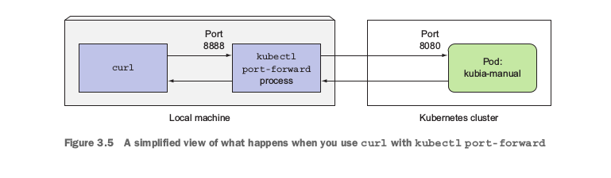
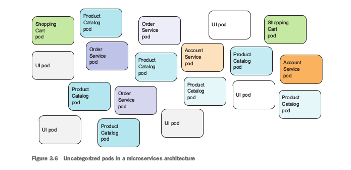

# Chapter # 3:


## Creating Pods from YAML or JSON Descriptors:
You’ll use the kubectl get
command with the -o yaml option to get the whole YAML definition of the pod, as
shown in the following listing.
```
$ kubectl get po kubia-zxzij -o yaml
```


## Creating a Simple YAML Descriptor For a Pod:
A basic pod manifest: kubia-manual.yaml.
```
apiVersion: v1
kind: Pod
metadata:
name: kubia-manual
spec:
containers:
- image: luksa/kubia
name: kubia
ports:
- containerPort: 8080
protocol: TCP
```
create a file and fill with this material
```
$ kubectl create -f kubia-manual.yaml
pod "kubia-manual" created
```
### Helpful Command:
For example, when creating a pod manifest from scratch, you can start by asking
kubectl to explain pods:
```
$ kubectl explain pods
DESCRIPTION:
Pod is a collection of containers that can run on a host. This resource
is created by clients and scheduled onto hosts.
FIELDS:
kind
<string>
Kind is a string value representing the REST resource this object
represents...
metadata <Object>
Standard object's metadata...
spec
<Object>
Specification of the desired behavior of the pod...
status
<Object>
Most recently observed status of the pod. This data may not be up to
date...
```
Kubectl prints out the explanation of the object and lists the attributes the object
can contain. You can then drill deeper to find out more about each attribute. For
example, you can examine the spec attribute like this:
```
$ kubectl explain pod.spec
RESOURCE: spec <Object>
DESCRIPTION:
Specification of the desired behavior of the pod...
podSpec is a description of a pod.
FIELDS:
hostPID
<boolean>
Use the host's pid namespace. Optional: Default to false.
...
volumes
```
### RETRIEVING THE WHOLE DEFINITION OF A RUNNING POD:
After creating the pod, you can ask Kubernetes for the full YAML of the pod or JSON.
```
$ kubectl get po kubia-manual -o yaml
            OR
$ kubectl get po kubia-manual -o json
```
## EDIT the Replication Controller:
```
kubectl edit rc kubia   (opens a VIM Editor) 
```

## Viewing application logs:
```
$ docker logs <container id>
```
### RETRIEVING A POD’S LOG WITH KUBECTL LOGS:
```
$ kubectl logs kubia-manual
Kubia server starting...
```
### SPECIFYING THE CONTAINER NAME WHEN GETTING LOGS OF A MULTI - CONTAINER POD:
If your pod includes multiple containers, you have to explicitly specify the container
name by including the -c <container name> option when running kubectl logs .
```
$ kubectl logs kubia-manual -c kubia
Kubia server starting...
```
### FORWARDING A LOCAL NETWORK PORT TO A PORT IN THE POD:
```
$ kubectl port-forward kubia-8q4q9 70:8080
... Forwarding from 127.0.0.1:70 -> 8080
... Forwarding from [::1]:70 -> 8080
```
```
curl localhost:70
You've hit kubia-8q4q9
```


## Organizing pods with labels:
As the number of
pods increases, the need for categorizing them into subsets becomes more and
more evident.For example, with microservices architectures, the number of deployed microser-
vices can easily exceed 20 or more.multiple versions or
releases (stable, beta, canary, and so on) will run concurrently. This can lead to hun-
dreds of pods in the system. Without a mechanism for organizing them, you end up
with a big, incomprehensible mess, such as the one shown in figure. It’s evident you need a way of organizing them into smaller groups based on arbitrary
criteria, so every developer and system administrator dealing with your system can eas-
ily see which pod is which.



## Introducing labels:
A label is an arbitrary key-value pair you
attach to a resource, which is then utilized when selecting resources using label selectors.Let’s turn back to the microservices example from figure. By adding labels to
those pods,Each pod is labeled with two labels:
- app , which specifies which app, component, or microservice the pod belongs to.
- rel , which shows whether the application running in the pod is a stable, beta,
  or a canary release.
  

## Specifying labels when creating a pod:
Create a new file called kubia-manual-with-labels.yaml.
```
$ kubectl create -f kubia-manual-with-labels.yaml
pod "kubia-manual-v2" created
```


### Lets do some fun with Replication Controller:
Change the label of kubia-whlck by:
```
$ kubectl edit pod kubia-whlck
```
Replication Identify the pod with label, so when the label of kubia-whlck changes it forget it and then start another pod.


if you’re only interested in certain labels, you can specify
them with the -L switch and have each displayed in its own column.
```
$ kubectl get pod -L creation_method,env
```
## Modifying labels of existing pods:
Labels can also be added to and modified on existing pods. Because the kubia-man-
ual pod was also created manually, let’s add the creation_method=manual label to it:
```
$ kubectl label pod <pod_name> manual1=code1
  pod "kubia-manual" labeled
```
You need to use the --overwrite option when changing existing labels.
```
$ kubectl label pod kubia-manual-v2 env=debug --overwrite
  pod "kubia-manual-v2" labeled
```
## Listing subsets of pods through label selectors:
Label selectors allow you to select a subset of pods tagged with certain labels and perform an
operation on those pods.
- Contains (or doesn’t contain) a label with a certain key.
- Contains a label with a certain key and value
- Contains a label with a certain key, but with a value not equal to the one you
  specify.
```
$ kubectl get pod -l run=kubia
```


Similarly, you could also match pods with the following label selectors:
- creation_method!=manual to select pods with the creation_method label with
any value other than manual
- env in (prod,devel) to select pods with the env label set to either prod or
devel
- env notin (prod,devel) to select pods with the env label set to any value other
than prod or devel

### Using multiple conditions in a label selector:
you’d use the following
selector: app=pc,rel=beta


## Using Namespaces to Group Resources:
Using multiple namespaces allows you to split complex systems with numerous com-
ponents into smaller distinct groups. They can also be used for separating resources
in a multi-tenant environment, splitting up resources into production, development,
and QA environments, or in any other way you may need. Resource names only need
to be unique within a namespace. Two different namespaces can contain resources of
the same name. But, while most types of resources are namespaced, a few aren’t. One
of them is the Node resource, which is global and not tied to a single namespace.


It will display the all podes present under "kube-system" namespace.

```
$ kubectl get po --namespace kube-system
```
Or, you can create it from file like:
```
$ kubectl create -f custom-namespace.yaml
  namespace "custom-namespace" created
```
###Note:
Only Resources can be created from files. labels can not created with files.

## Managing Objects in Other Namespaces:
```
$ kubectl create -f kubia-manual.yaml -n custom-namespace
  pod "kubia-manual" created
```
## Deleting a pod by name:
First, delete the kubia-gpu pod by name:
```
$ kubectl delete po kubia-gpu
  pod "kubia-gpu" deleted
```
## Deleting pods using label selectors:
```
$ kubectl delete po -l creation_method=manual
  pod "kubia-manual" deleted
  pod "kubia-manual-v2" deleted
```
## Deleting a namespce:
delete the whole namespace (the pods will be deleted along with the namespace auto-
matically), using the following command:
```
$ kubectl delete ns custom-namespace
  namespace " custom-namespace " deleted
```
## Deleting (almost) all resources in a namespace:
```
$ kubectl delete all --all
  pod "kubia-09as0" deleted
  replicationcontroller "kubia" deleted
  service "kubernetes" deleted
  service "kubia-http" deleted
```
# Summary:
- Pods can run multiple processes and are similar to physical hosts in the non-container world.
- YAML or JSON descriptors can be written and used to create pods and then examined to see the      specification of a pod and its current state.
- Labels and label selectors should be used to organize pods and easily perform operations on       multiple pods at once.
- You can use node labels and selectors to schedule pods only to nodes that have
  certain features.
- Annotations allow attaching larger blobs of data to pods either by people or
  tools and libraries.
- Namespaces can be used to allow different teams to use the same cluster as though they were       using separate Kubernetes clusters.
- How to use the kubectl explain command to quickly look up the information on any Kubernetes       resource.