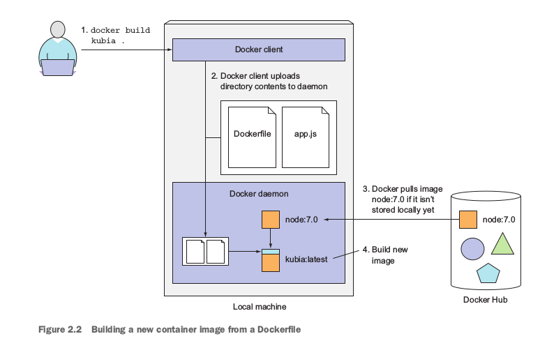

# Getting Started With Kubernetes


-  `Kubernetes is an open source container orchestration engine for automating deployment, scaling, and management of containerized applications.`
-  `It groups containers that make up an application into logical units for easy management and discovery.`
-  `Kubernetes is a container orchestration system for Docker containers that is more extensive than Docker Swarm and is meant to coordinate clusters of nodes at scale in production in an efficient manner.`

## REQUIREMENTS:


- You should have good knowledge of docker to get hands on [kubernetes](https://kubernetes.io/).
- It is good to have [Linux](https://www.linux.org/) OS.
- Have [Docker](http://docs.docker.com/engine/installation/) Installed.
- Have an account on [Docker Hub](https://hub.docker.com)

    
## Creating, Running, and Sharing a Container Image:

```
- Creating a trivial Node.js app
- Creating a Dockerfile for the image
- Building the container image
```
### Command:

```
$ docker build -t kubia .
```
