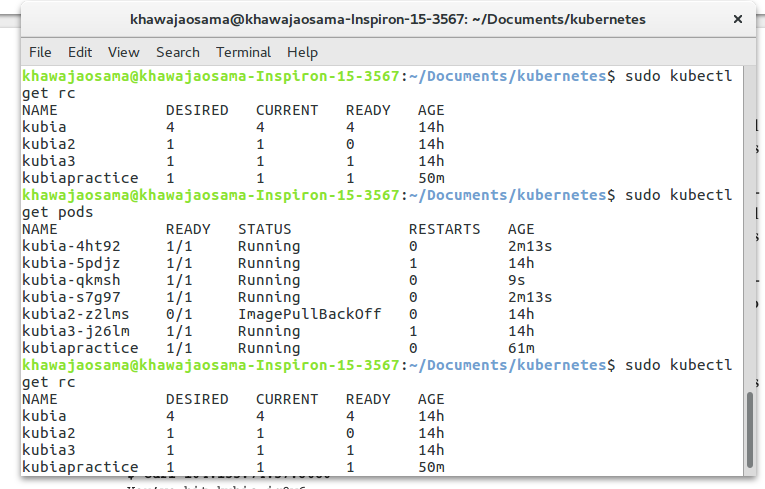

# Getting Started With Kubernetes


-  `Kubernetes is an open source container orchestration engine for automating deployment, scaling, and management of containerized applications.`
-  `It groups containers that make up an application into logical units for easy management and discovery.`
-  `Kubernetes is a container orchestration system for Docker containers that is more extensive than Docker Swarm and is meant to coordinate clusters of nodes at scale in production in an efficient manner.`

## REQUIREMENTS:


- You should have good knowledge of docker to get hands on [kubernetes](https://kubernetes.io/).
- It is good to have [Linux](https://www.linux.org/) OS.
- Have [Docker](http://docs.docker.com/engine/installation/) Installed.
- Have an account on [Docker Hub](https://hub.docker.com)

    
## Creating, Running, and Sharing a Container Image:

### Building the container image:

```
- Creating a trivial Node.js app
- Creating a Dockerfile for the image
- Building the container image
```
### Command:

```
$ docker build -t kubia .
```


## Running the Container Image:
```
$ docker run --name kubia-container -p 8080:8080 -d kubia
$ ping http://localhost:8080
    You’ve hit 44d76963e8e1
```
## Pushing the Image to an Image Registry:

```
$ docker tag kubia khawajaosama/kubia
$ docker push khawajaosama/kubia
```
## Setting Up A Kubernetes Cluster:

The simplest and quickest path to a fully functioning Kubernetes cluster is by using
Minikube. Minikube is a tool that sets up a single-node cluster that’s great for both
testing Kubernetes and developing apps locally.

### Running a local single-node Kubernetes cluster with Minikube:
```
$ curl -Lo minikube https://storage.googleapis.com/minikube/releases/v0.23.0/minikube-linux-amd64 && chmod +x minikube && sudo mv minikube /usr/local/bin/
```
### Starting a Minikube Virtual Machine:

```
$ minikube start
Starting local Kubernetes cluster...
Starting VM...
SSH-ing files into VM...
...
Kubectl is now configured to use the cluster.
("It will take 5-6 min, depends on your configuration so dont panic, mine laptop took 10 mins")
```
### INSTALLING THE KUBERNETES CLIENT ( KUBECTL ):
```
$ curl -LO https://storage.googleapis.com/kubernetes-release/release/$(curl -s https://storage.googleapis.com/kubernetes-release/release/stable.txt)/bin/linux/amd64/kubectl && chmod +x kubectl && sudo mv kubectl /usr/local/bin/
```

### Displaying Cluster Information:
```
$ kubectl cluster-info

Kubernetes master is running at https://192.168.99.108:8443
KubeDNS is running at https://192.168.99.108:8443/api/v1/namespaces/kube-system/services/kube-dns:dns/proxy
```


### CHECKING IF THE CLUSTER IS UP BY LISTING CLUSTER NODES:

```
$ kubectl get nodes

NAME       STATUS   ROLES    AGE   VERSION
minikube   Ready    master   89m   v1.12.4
```

### RETRIEVING ADDITIONAL DETAILS OF AN OBJECT:
```
$ kubectl describe node minikube
```


## Running your first app on Kubernetes:

### Deploying your Node.js app:
```
$ kubectl run kubia --image=luksa/kubia --port=8080 --generator=run/v1
replicationcontroller "kubia" created
```
### INTRODUCING PODS:
A pod is a group of one or more tightly related containers that will always run
together on the same worker node and in the same Linux namespace(s). Each pod
is like a separate logical machine with its own IP, hostname, processes, and so on,
running a single application.

### Listing Pods:
```
$ kubectl get pods

NAME         READY  STATUS   RESTARTS   AGE
kubia-4jfyf   0/1   Pending     0       1m

(Take some minutes)

NAME         READY  STATUS   RESTARTS   AGE
kubia-4jfyf   1/1   Running     0       1m
```


## Accessing Your Web Application:
To make the pod accessible from the outside, you’ll expose it through a
Service object. You’ll create a special service of type LoadBalancer , because 
if you create a regular service (a ClusterIP service), like the pod, it would also only be 
accessible from inside the cluster.

### CREATING A SERVICE OBJECT:
```
$ kubectl expose rc kubia --type=LoadBalancer --name kubia-http
service "kubia-http" exposed
```
### LISTING SERVICES:
```
NAME        CLUSTER-IP    EXTERNAL-IP    PORT(S)         AGE
kubernetes  10.3.240.1    <none>         443/TCP         35m
kubia-http  10.3.246.185  104.155.74.57  8080:31348/TCP  1m
(Take some time)
```
### NOTE:
Minikube doesn’t support LoadBalancer services, so the service will
never get an external IP. But you can access the service anyway through its
external port. How to do that is described in the next section’s tip.

### ACCESSING YOUR SERVICE THROUGH ITS EXTERNAL IP:
You can now send requests to your pod through the service’s external IP and port:
```
$ minikube service kubia-http
```


### Horizontally Scaling the Application:
```
$ kubectl get replicationcontrollers

NAME DESIRED CURRENT AGE
kubia   1       1   17m
```
### INCREASING THE DESIRED REPLICA COUNT:
```
$ kubectl scale rc kubia --replicas=3
replicationcontroller "kubia" scaled
```


### SEEING REQUESTS HIT ALL THREE PODS WHEN HITTING THE SERVICE:
Because you now have multiple instances of your app running, let’s see what happens
if you hit the service URL again. Will you always hit the same app instance or not?


### DISPLAYING THE POD IP AND THE POD’S NODE WHEN LISTING PODS
```
$ kubectl get pods -o wide
NAME            READY   STATUS             RESTARTS   AGE   IP            NODE       NOMINATED NODE
kubia-4ht92     1/1     Running            0          27m   172.17.0.10   minikube   <none>
kubia-5pdjz     1/1     Running            1          14h   172.17.0.4    minikube   <none>
kubia-qkmsh     1/1     Running            0          25m   172.17.0.11   minikube   <none>
kubia-s7g97     1/1     Running            0          27m   172.17.0.9    minikube   <none>
```
## Introducing The Kubernetes Dashboard:
```
$ minikube dashboard
```


## Creating Pods from YAML or JSON Descriptors:
You’ll use the kubectl get
command with the -o yaml option to get the whole YAML definition of the pod, as
shown in the following listing.
```
$ kubectl get po kubia-zxzij -o yaml
```


## Creating a Simple YAML Descriptor For a Pod:
A basic pod manifest: kubia-manual.yaml.
```
apiVersion: v1
kind: Pod
metadata:
name: kubia-manual
spec:
containers:
- image: luksa/kubia
name: kubia
ports:
- containerPort: 8080
protocol: TCP
```
create a file and fill with this material
```
$ kubectl create -f kubia-manual.yaml
pod "kubia-manual" created
```
### Helpful Command:
For example, when creating a pod manifest from scratch, you can start by asking
kubectl to explain pods:
```
$ kubectl explain pods
DESCRIPTION:
Pod is a collection of containers that can run on a host. This resource
is created by clients and scheduled onto hosts.
FIELDS:
kind
<string>
Kind is a string value representing the REST resource this object
represents...
metadata <Object>
Standard object's metadata...
spec
<Object>
Specification of the desired behavior of the pod...
status
<Object>
Most recently observed status of the pod. This data may not be up to
date...
```
Kubectl prints out the explanation of the object and lists the attributes the object
can contain. You can then drill deeper to find out more about each attribute. For
example, you can examine the spec attribute like this:
```
$ kubectl explain pod.spec
RESOURCE: spec <Object>
DESCRIPTION:
Specification of the desired behavior of the pod...
podSpec is a description of a pod.
FIELDS:
hostPID
<boolean>
Use the host's pid namespace. Optional: Default to false.
...
volumes
```
### RETRIEVING THE WHOLE DEFINITION OF A RUNNING POD:
After creating the pod, you can ask Kubernetes for the full YAML of the pod or JSON.
```
$ kubectl get po kubia-manual -o yaml
            OR
$ kubectl get po kubia-manual -o json
```
## EDIT the Replication Controller:
```
kubectl edit rc kubia   (opens a VIM Editor) 
```

## Viewing application logs:
```
$ docker logs <container id>
```
### RETRIEVING A POD’S LOG WITH KUBECTL LOGS:
```
$ kubectl logs kubia-manual
Kubia server starting...
```
### SPECIFYING THE CONTAINER NAME WHEN GETTING LOGS OF A MULTI - CONTAINER POD:
If your pod includes multiple containers, you have to explicitly specify the container
name by including the -c <container name> option when running kubectl logs .
```
$ kubectl logs kubia-manual -c kubia
Kubia server starting...
```
### FORWARDING A LOCAL NETWORK PORT TO A PORT IN THE POD:
```
$ kubectl port-forward kubia-8q4q9 70:8080
... Forwarding from 127.0.0.1:70 -> 8080
... Forwarding from [::1]:70 -> 8080
```
```
curl localhost:70
You've hit kubia-8q4q9
```


## Organizing pods with labels:
As the number of
pods increases, the need for categorizing them into subsets becomes more and
more evident.For example, with microservices architectures, the number of deployed microser-
vices can easily exceed 20 or more.multiple versions or
releases (stable, beta, canary, and so on) will run concurrently. This can lead to hun-
dreds of pods in the system. Without a mechanism for organizing them, you end up
with a big, incomprehensible mess, such as the one shown in figure. It’s evident you need a way of organizing them into smaller groups based on arbitrary
criteria, so every developer and system administrator dealing with your system can eas-
ily see which pod is which.


## Introducing labels:
